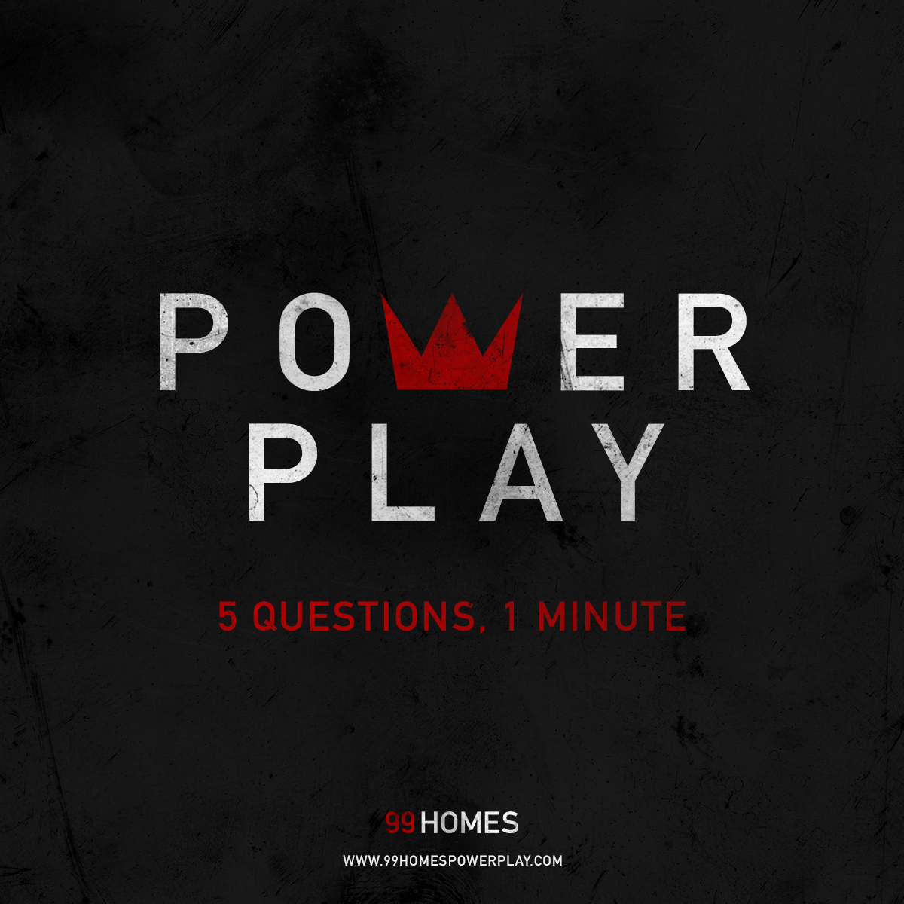
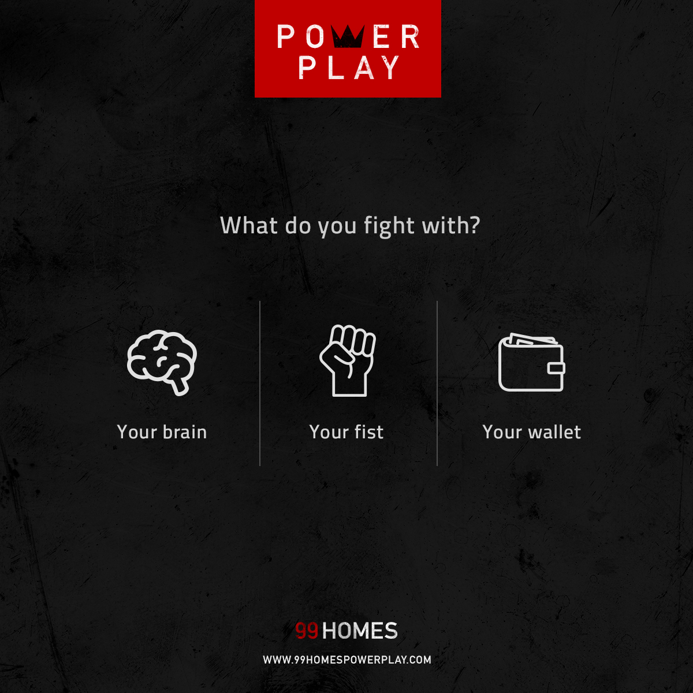
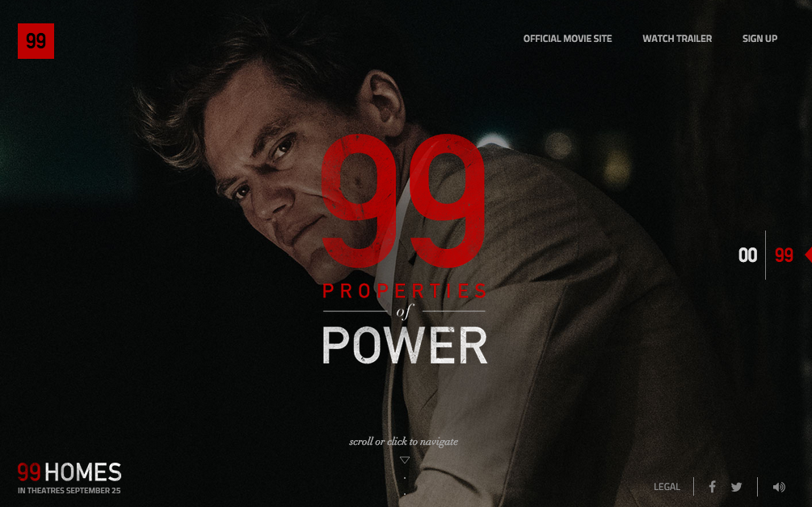
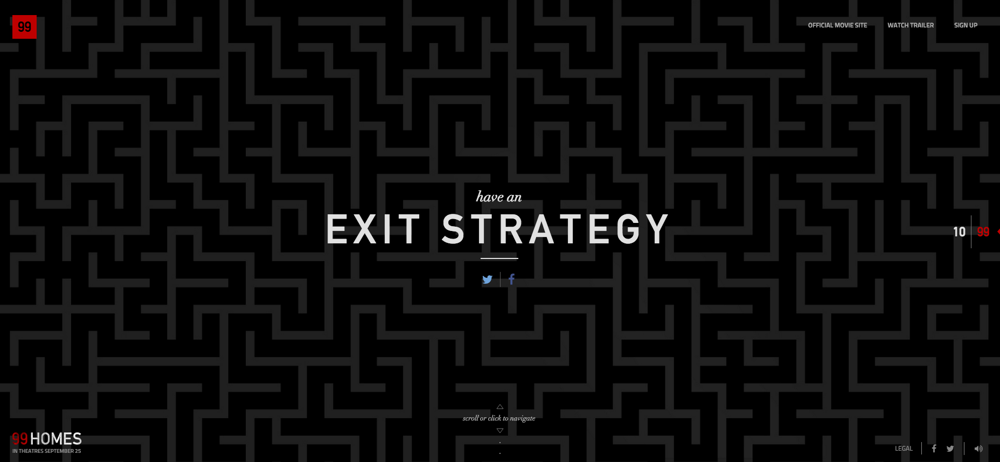
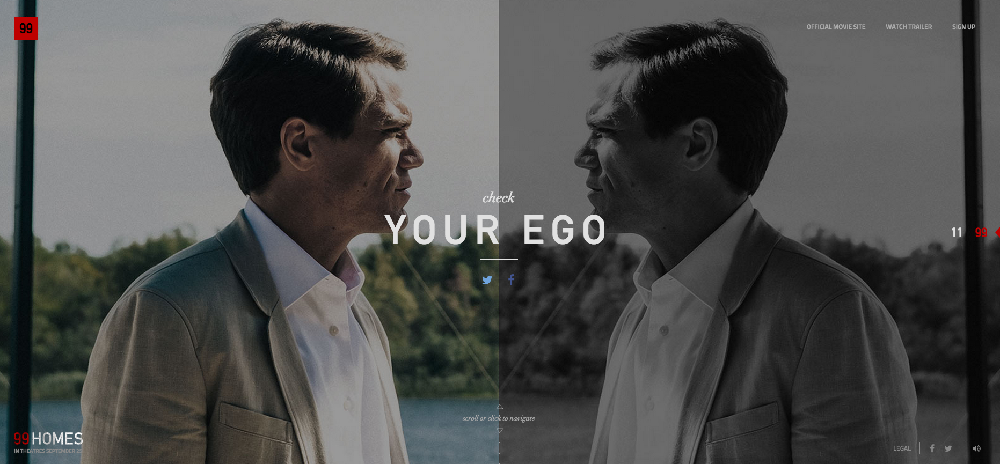

<i>99 Homes</i> is an acclaimed indie thriller set in Florida during the 2008 housing crisis. For Broad Green Pictures, we launched a digital campaign that explored the tension between the film's pervasive themes of power vs. morality. I helped craft the copy. 

### Power Play

Much like the film's protagonist, users are put to the moral test in this timed five-question online survey. 

### 99 Properties of Power 

What is power? How does it look and feel? In honor of the film's Gordon Gekko-esque villain, we showcased all 99 elements of power in this shareable digital experience. 

