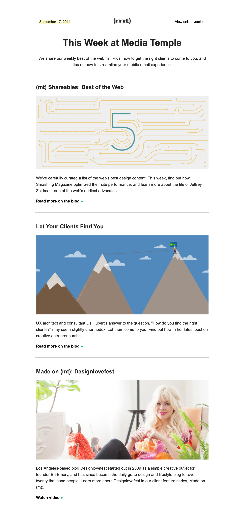
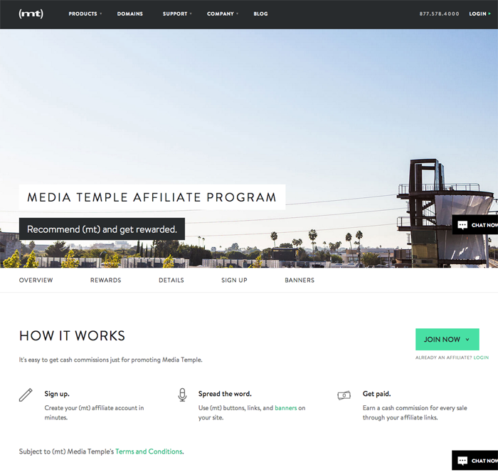
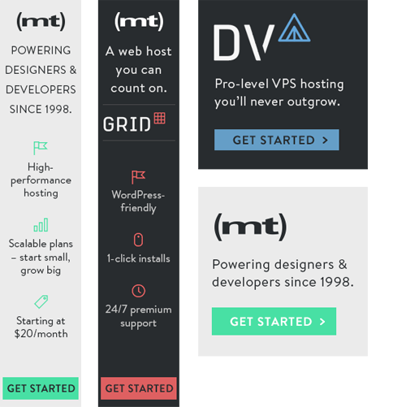

Media Temple (now a GoDaddy company) is the premiere web hosting and cloud solutions service for designers and developers, hosting over 125,000 customers worldwide.

### Email marketing

I helped develop and launch Media Temple’s email marketing program. I also wrote and curated content for the weekly email newsletter, which went out to over 120,000 subscribers. 

 

### Landing page copy

I ideated and executed on copy for Media Temple's customer referral and partnership program. I also managed the thing, but that's another story from a former life. 

### Banner ads

I wrote optimized-for-ROI banner ad copy. Because $$$$ is important.

