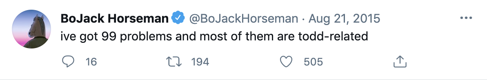

A washed-up cartoon horse attempts to make his way back into the Hollywood limelight. What better place to validate his craving for attention than the Internet? For Netflix's cult show _BoJack Horseman_, I crafted copy across a variety of social platforms in the form of character profiles, viral tweets, and branded asset copy. 

### LinkedIn 

I expanded BoJack's universe beyond traditional social media by creating LinkedIn profiles for the show's colorful supporting cast of professionals: a feline talent agent and a business executive (actually, he's just three kids stacked on top of each other). 

### Facebook & Twitter

For each episode, we created a series of shareable memes & tweets. I executed on social copy in line with the character's voice and tone. 

 

