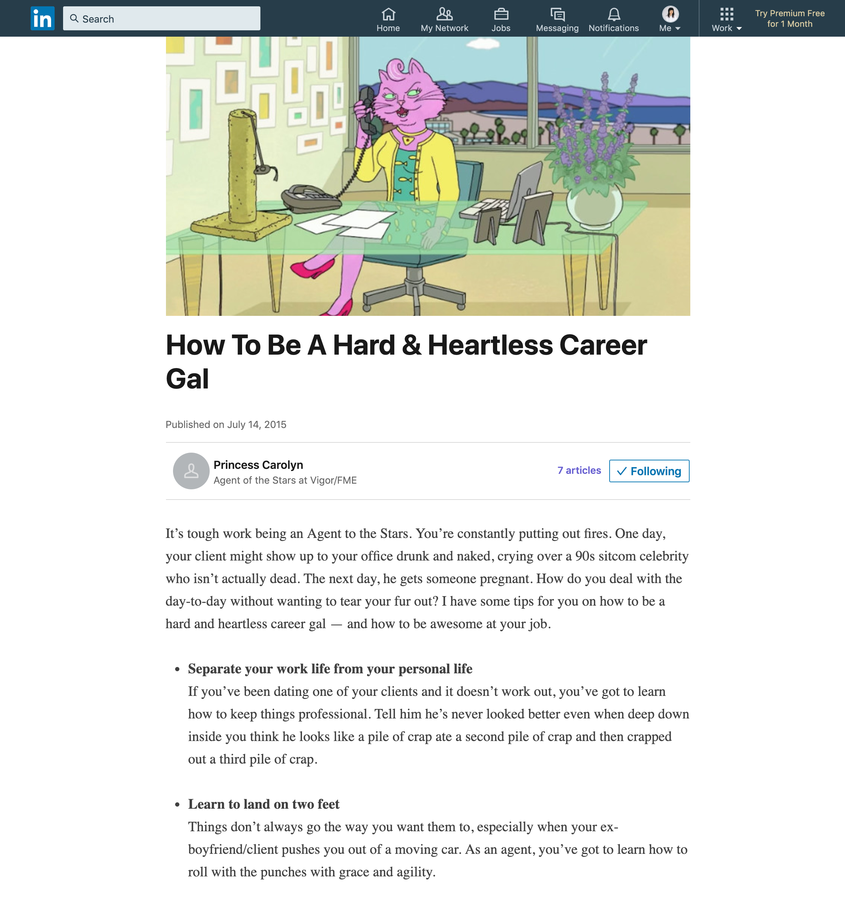
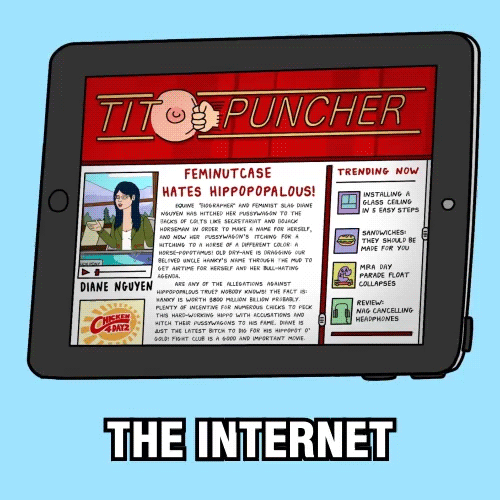

A washed-up cartoon horse attempts to make his way back into the Hollywood limelight. What better place to validate his craving for attention than on the Internet? 

In support of Netflix's Season 2 premiere, we broadcasted BoJack’s cynical thoughts across a variety of digital platforms through viral tweets, illustrations, and branded content. 

### LinkedIn 

We expanded BoJack's universe beyond traditional social media by creating LinkedIn profiles for the show's colorful supporting cast of professionals: a feline talent agent and a business executive (actually, he's just three kids stacked on top of each other). 

### Facebook & Twitter

For each episode, we created a series of shareable memes & tweets. 

 

<blockquote class="twitter-tweet" data-lang="en">
just swipe left on honeydew
— BoJack Horseman (@BoJackHorseman) <a href="https://twitter.com/BoJackHorseman/status/632002211665481728">August 14, 2015</a></blockquote>
<blockquote class="twitter-tweet" data-lang="en">
why does intimacy feel like i just ate a bunch of spiders?
— BoJack Horseman (@BoJackHorseman) <a href="https://twitter.com/BoJackHorseman/status/632369897406787584">August 15, 2015</a></blockquote>
<blockquote class="twitter-tweet" data-lang="en">
ive got 99 problems and most of them are todd-related
— BoJack Horseman (@BoJackHorseman) <a href="https://twitter.com/BoJackHorseman/status/634912938906796032">August 22, 2015</a></blockquote>
<blockquote class="twitter-tweet" data-lang="en">
I'M ON A BOAT  ….hanging out as our nation's first president. thanks for the cameo, <a href="https://twitter.com/drunkhistory">@DrunkHistory</a>! <a href="http://t.co/OCCloEO6Sr">pic.twitter.com/OCCloEO6Sr</a>
— BoJack Horseman (@BoJackHorseman) <a href="https://twitter.com/BoJackHorseman/status/638788623077388289">September 1, 2015</a></blockquote>

